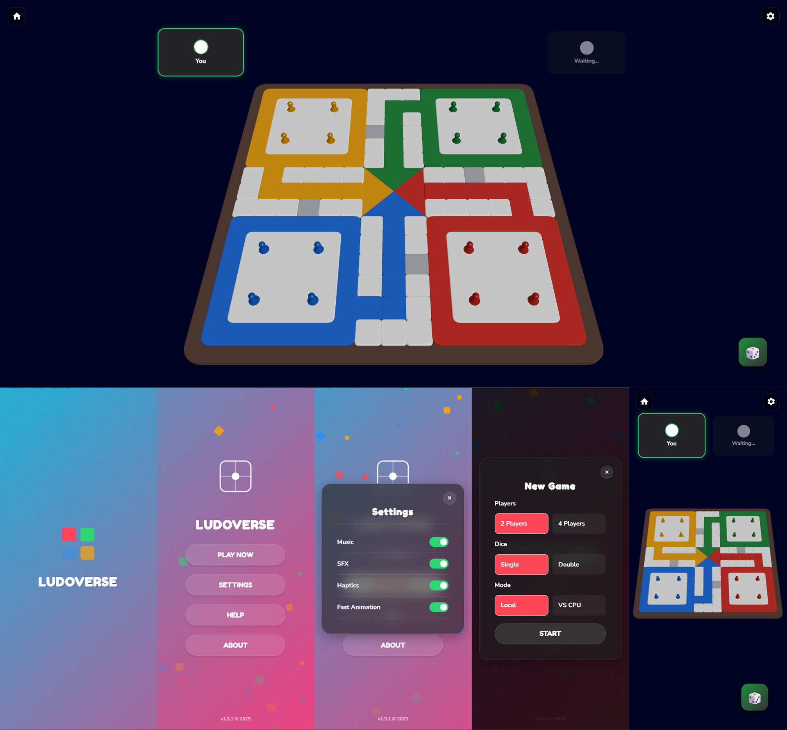

# Ludoverse — 3D Ludo Game

A fully self-contained **3D Ludo game** built as a single HTML file using **Three.js (via CDN)**. This project was created for the **Nairaland Full‑stack Vibe Engineering Challenge #1**.

🔗 **Live Demo:** [http://dipo1.github.io/ludoverse](http://dipo1.github.io/ludoverse)

---

## 📸 Preview



---

## 🧩 Challenge Brief

This project was developed in response to the following challenge:

> Build an enjoyable **3D Ludo game** in a **single HTML file**, using **Three.js via CDN**, with clearly defined rules. Creativity, polish, performance, and unique features are strongly rewarded.

**Host:** Nairaland (Seun)

---

## 🎮 Game Features

* Fully playable **3D Ludo board** rendered with Three.js
* **Single HTML file** (no build tools, no bundlers)
* Supports:

  * 2 or 4 players
  * Local multiplayer
  * VS CPU mode
  * Single or double dice mode
* Smooth camera controls with OrbitControls
* Visual highlights for valid moves
* Pawn capture and safe zones
* Animated dice rolls
* In‑game HUD and modals
* Settings for:

  * Music
  * Sound effects
  * Haptics (where supported)
  * Fast animations
* Mobile‑friendly UI and touch support

---

## 📜 Rules (In‑Game)

1. Roll a **6** to move a pawn out of base.
2. Rolling a **6** grants an extra turn.
3. Landing on an opponent sends them back to base.
4. **Safe tiles** cannot be captured.
5. First player to move all **4 pawns to the center** wins.

*(Exact rules are also displayed inside the game UI.)*

---

## 🛠️ Tech Stack

* **HTML5 / CSS3 / Vanilla JavaScript**
* **Three.js** (CDN)
* Web Audio API (for music & SFX)
* No external assets or dependencies
* No backend — runs entirely in the browser

---

## 📁 Project Structure

```text
/
└── index.html   # Entire game (UI, logic, 3D rendering)
```

---

## 🚀 Running Locally

No setup required.

1. Download `index.html`
2. Open it directly in a modern browser (Chrome recommended)

> ⚠️ Some browsers may restrict audio autoplay until user interaction.

---

## 🧠 Notable Implementation Details

* Reusable shared geometries and materials for performance
* Logical Ludo path mapping abstracted from 3D coordinates
* CPU player uses heuristic‑based move scoring
* Game state fully resettable without page reload
* Adaptive camera fitting for different screen sizes

---

## 🏆 Submission Notes

* Developed using Git for source control
* Repository was kept private until after the deadline
* No changes were made post‑deadline
* Hosted via GitHub Pages

---

## 👤 Author

**Dipo**

* GitHub: [https://github.com/dipo1](https://github.com/dipo1)
* Project Page: [http://dipo1.github.io/ludoverse](http://dipo1.github.io/ludoverse)

---

## 📄 License

This project is provided for demonstration and challenge evaluation purposes. All rights reserved by the author.
